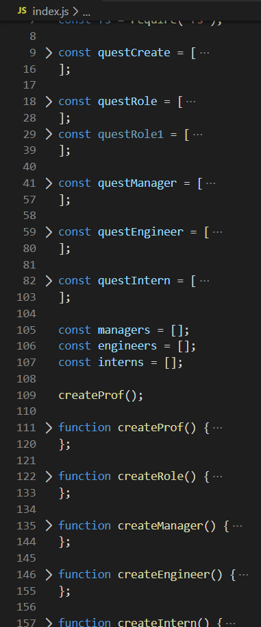

# Team Profile Generator
A command line interface that allows a manager to create a roster for their team. The profiles generated are organized into Manager, Engineer, and Intern. Once the profiles are complete, the CLI exits and pushes the information into an HTML page for easy viewing.

## Screen Grab 

Image of CLI in action.

## Built With

* [HTML](https://developer.mozilla.org/en-US/docs/Web/HTML)
* [CSS](https://developer.mozilla.org/en-US/docs/Web/CSS)
* [Bootstrap](https://getbootstrap.com)
* [JavaScript](https://javascript.com)
* [nodejs](https://nodejs.com)

Examples of the variables and functions when collapsed and when unpacked.

## Deployed Link

* [Github Repository Page](https://github.com/rev1311/team_prof_gen)

## Authors

* **Michael Partin** 

- [Link to Portfolio Site](https://rev1311.github.io/updated-portfolio/)
- [Link to Github](https://github.com/rev1311)
- [Link to LinkedIn](https://linkedin.com/in/michael-partin)

See also the list of [contributors](https://github.com/your/project/contributors) who participated in this project. HINT: Just me.

## Acknowledgments

* 

